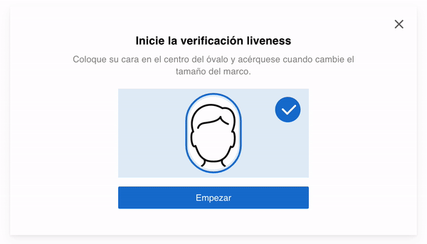

# 👉 ¿Por qué usar KYC Componentes?

Está compuesto por 3 elementos


Requiere instalación de la librería y configuración del clientId y Secret key. En el siguiente apartado mostraremos el paso a paso.


## 1 - LivenessCheck

Componente que da fe de vida de la persona frente a la cámara, entre los datos que retorna este componente se encuentra la foto de la persona la cual fue validada, esta foto podrá ser comparada contra un documento de identidad o una base de datos para asegurar que sea la misma persona. Otras funciones que puede encontrar:

* Valida si realmente es un adulto
* Si usa mascarilla medica, lentes, sombrero

<figure><figcaption></figcaption></figure>

## 2 - Lista de sanciones

Componente que permite consultar la existencia de una persona en alguna de las listas de sanciones, ofreciendo garantía y seguridad ante el registro de un usuario. Entre los datos que retorna el componente puede encontrar:

* Nombre de la lista
* Fecha en la que fue ingresado a la lista
* País

<figure><figcaption></figcaption></figure>

## 3 - Lectura de documento de identidad (OCR)

Componente que solicita cargar un documento de identidad, reconoce la información y extrae para ser retornada en formato JSON, con esto permite automatizar la captura de datos y reduce el margen de error en una transcripción. Los datos que retorna el componente son todos los capturados del documento. (Varían de acuerdo al país)

<figure><figcaption></figcaption></figure>

## 4 - FaceMatch

Componente que recibe un rostro en formato base64 y compara contra el selfie que captura en el momento. Entre los datos que retorna se encuentra el % de similitud entre ambos rostros.

<figure><figcaption></figcaption></figure>
