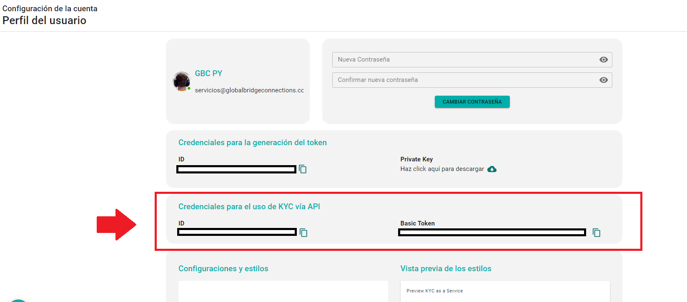

# ☁️ KYC como API Rest Service

## Inicio

Esta guía explica cómo obtener el Access Token de Identidad Digital Global (IDG)  para realizar llamadas a los endpoints de los servicio de biometría, lectura y extracción de datos de de documentos de identificación, las reglas de uso y el vencimiento del token.

IDG es un producto desarrollado por Global Bridge Connections, con marca registrada en Paraguay, Perú, Panamá y los Estados Unidos de América.&#x20;

#### Audiencia

Esta guía está orientada para personas con conocimientos en API Rest y conceptos de programación que desean utilizar la API Rest de IDG.

## Ambientes

El cliente dispondrá de dos ambientes totalmente independientes para utilizar los Endpoints de KYC API Rest Service y estas son:

#### Staging

Ambiente proveída al cliente para realizar sus pruebas y familiarizarse con el producto.

El Portal KYC se accede con la siguiente url: [https://dash-kyc-staging.globalbridgeconnections.com.py](https://dash-kyc-staging.globalbridgeconnections.com.py/)/

Host Api: [https://stagingservices.globalbridgeconnections.com.py](https://stagingservices.globalbridgeconnections.com.py)/

#### Production

Ambiente proveída al cliente con el cual operará una vez culminada sus pruebas con el producto.

El Portal KYC se accede con la siguiente url: [https://dash-kyc.globalbridgeconnections.com.py/](https://dash-kyc.globalbridgeconnections.com.py/)

Host Api: [https://services.globalbridgeconnections.com.py](https://services.globalbridgeconnections.com.py)/

## Autorización

Los endpoints de KYC Api Rest  Service requieren del id de cliente y de un Access Token como autorización, el cual debe ser generado por el cliente con la llave provista por Global Bridge Connections de manera confidencial a cada empresa cliente.

* &#x20;Un Basic Token, la cual deberá ser almacenada de forma segura de lado del cliente que utilizará los servicios de IDG.

Ambos datos también son accesibles desde el Portal KYC -> Mi Perfil

<figure><figcaption></figcaption></figure>

Obs: Las credenciales podrían ser distintas según el ambiente en la que opere.

### Endpoint para Generar Access Token

## Generar Access Token

<mark style="color:green;">`POST`</mark> `{{host_api}}/oauth/access-token`

Endpoint que se encarga de generar el access token que se utilizará como authorizacion en los endpoints de KYC API Rest Services

#### Headers

| Name                                            | Type   | Description              |
| ----------------------------------------------- | ------ | ------------------------ |
| Authorization<mark style="color:red;">\*</mark> | String | Basic  Token del Cliente |

#### Request Body

| Name                                          | Type   | Description                                 |
| --------------------------------------------- | ------ | ------------------------------------------- |
| grant\_type<mark style="color:red;">\*</mark> | String | "client\_credentials " <- valor por defecto |



```json
{
    "access_token": "85edecf8-f474-4f74-95a6-8e108a70d50b", //access token que sera utilizado como authorization en las llamadas a los endpoints de KYC
    "token_type": "access_token",
    "expires_in": 3600 // duracion en segundos del access token
}
```



```json
{
    "message": string, //mensaje de error
    "data": [],
    "code": string //codigo de error
}
```



<pre><code><strong>{
</strong>    "message": string, //mensaje de error
    "data": [],
    "code": string //codigo de error
}
</code></pre>




## KYC API Rest Service

### 1- Lectura de documento de identidad (OCR)

## Lectura de documento de identidad (OCR)

<mark style="color:green;">`POST`</mark> `{{host_api}}/api/v1/kyc-kit/service/ocr`

Endpoint para recuperar los datos extraidos de documentos

#### Headers

| Name                                            | Type   | Description                          |
| ----------------------------------------------- | ------ | ------------------------------------ |
| access\_token<mark style="color:red;">\*</mark> | String | access\_token generado anteriormente |
| client\_id<mark style="color:red;">\*</mark>    | String | client id provista por GBC           |

#### Request Body

| Name                                           | Type   | Description                                                            |
| ---------------------------------------------- | ------ | ---------------------------------------------------------------------- |
| first\_image<mark style="color:red;">\*</mark> | String | imagen en base 64 del documento del cual se quiera recuperar los datos |
| second\_image                                  | String | imagen en base 64 del documento del cual se quiera recuperar los datos |



```json
{
  "code": string,
  "message": string,
  "data": {
    "status": string,//Vigencia del documento
    "reference": string,
    "reference_image": string,//Imagen en base64 del carnet encontrado en el documento 
    "document_country": string,//codigo ISO3166-alpha3 de País del documento
    "document_number": string,
    "document_category": string,//categoria del documento
    "first_name": string,
    "last_name": string,
    "first_last_name": string,
    "second_last_name": string | null,
    "date_of_birth": string | null,// Fecha de nacimiento con formato del documento
    "date_of_birth_std": string | null,//Fecha de nacimiento con formato estandarizado
    "mothers_name": string | null,
    "fathers_name": string | null,
    "address": string | null,
    "mrz": string | null,
    "date_expiry": string | null,
    "nationality_code": string,//codigo ISO3166-alpha3 de Nacionalidad
    "document_type": string,
    "first_image": string,
    "second_image": string,
    "qa_moire_present": boolean,//Se observo patrones moire en el documento?
    "qa_doc_incomplete": boolean,//El documento estába completo? 
    "qa_doc_out_perspective": boolean,//El documento estába fuera de perspectiva? 
    "qa_doc_out_focus": boolean,//El documento estaba fuera de foco?
    "sex": string | null,//sexo que aparece en el documento
    "marital_status": string | null,
    "count_side_doc_analyzed": number,//cantidad de lados que se analizó del documento
    "donor": string | null,
    "height": number | null,
    "blood_group": string | null
  }
}
```



```
{
    "message": string, //mensaje de error
    "data": [],
    "code": string //codigo de error
}
```



```javascript
{
    "message": string, //mensaje de error
    "data": [],
    "code": string //codigo de error
}
```



```javascript
{
    "message": string, //mensaje de error
    "data": [],
    "code": string //codigo de error
}
```



### 2 - FaceMatch

## FaceMatch

<mark style="color:green;">`POST`</mark> `{{host_api}}/api/v1/kyc-kit/service/facematch`

Endpoint para recuperar similitud entre dos rostros

#### Headers

| Name                                            | Type   | Description                          |
| ----------------------------------------------- | ------ | ------------------------------------ |
| access\_token<mark style="color:red;">\*</mark> | String | access\_token generado anteriormente |
| client\_id<mark style="color:red;">\*</mark>    | String | client id provista por GBC           |

#### Request Body

| Name                                            | Type   | Description                                                     |
| ----------------------------------------------- | ------ | --------------------------------------------------------------- |
| first\_image<mark style="color:red;">\*</mark>  | String | imagen en base 64 de rostro a comparar la con la segunda imagen |
| second\_image<mark style="color:red;">\*</mark> | String | imagen en base 64 de rostro a comparar la con la primera imagen |
| gt\_similarity                                  | number | criterio de aceptación max 1, 1 = 100%, por defecto 0.75 = 75%  |



```json
{
  "code": "string",
  "message": "string",
  "data": {
    "similarity": number, //similitud entre rostros comparados 1= 100%
    "validated_criteria": number, //valor de criterio de aceptación ingresada
    "validated": boolean, // es similarity >= validate_criteria?
    "validated_message": "string", //mensaje de validación
  }
}
```



```json
{
    "message": string, //mensaje de error
    "data": [],
    "code": string //codigo de error
}
```



<pre><code><strong>{
</strong>    "message": string, //mensaje de error
    "data": [],
    "code": string //codigo de error
}
</code></pre>



```javascript
{
    "message": string, //mensaje de error
    "data": [],
    "code": string //codigo de error
}
```



### 3- Lista de sanciones y PEP's

## Create a new user

<mark style="color:green;">`POST`</mark> `/users`

\<Description of the endpoint>

**Headers**

| Name          | Value              |
| ------------- | ------------------ |
| Content-Type  | `application/json` |
| Authorization | `Bearer <token>`   |

**Body**

| Name               | Type   | Description                          |
| ------------------ | ------ | ------------------------------------ |
| `first_name`       | string | primer nombre                        |
| second\_name       | string | segundo nombre                       |
| first\_last\_name  | string | primer apellido                      |
| second\_last\_name | string | segundo apellido                     |
| birth\_date        | string | fecha nacimiento formato: yyyy-mm-dd |
| country            | string | lugar de nacimiento formato ISO 3166 |

**Response**



```json
{
  "code": "string",
  "message": "string",
  "data": {
    "result": string, //mensaje de si se encontro o no coincidencias
    "match": json_array // array de listas de sanciones y/o pep en la que se encontraron coincidencias
  }
}
```



```json
{
    "message": string, //mensaje de error
    "data": [],
    "code": string //codigo de error
}
```



```
{
    "message": string, //mensaje de error
    "data": [],
    "code": string //codigo de error
}
```



<pre><code><strong>{
</strong>    "message": string, //mensaje de error
    "data": [],
    "code": string //codigo de error
}
</code></pre>


