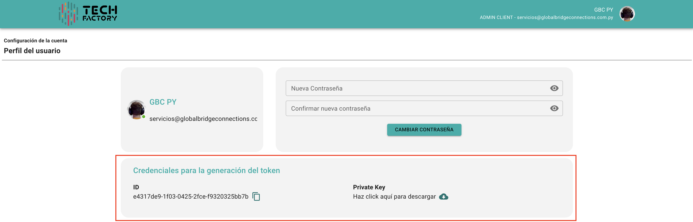

# 🔐 Secure Link - Implementación

## Inicio

Esta guía explica cómo obtener un JWT de Identidad Digital Global (IDG) para comunicarse con el servicio de biometría, lectura y extracción de datos de de documentos de identificación, las reglas de uso y el vencimiento del token.&#x20;

IDG es un producto desarrollado por Global Bridge Connections, con marca registrada en Paraguay, Perú, Panamá y los Estados Unidos de América.&#x20;

#### Audiencia&#x20;

Esta guía está orientada para personas con conocimientos en JavaScript, conceptos de programación y programación orientada a objetos, que desean utilizar la API de IDG.

## Ambientes

El cliente dispondrá de dos ambientes totalmente independientes para utilizar el Secure LInk y estas son:

#### Staging

Ambiente proveída al cliente para realizar sus pruebas y familiarizarse con el producto.

El Portal KYC se accede con la siguiente url: [https://dash-kyc-staging.globalbridgeconnections.com.py](https://dash-kyc-staging.globalbridgeconnections.com.py/)/

Host Api: [https://stagingservices.globalbridgeconnections.com.py](https://stagingservices.globalbridgeconnections.com.py)/  <mark style="color:$danger;">(Deprecado desde el 19/08/2025)</mark>

Host Api: [https://gbc-py-core-staging-api-products-rtm3lv2joa-uc.a.run.app/](https://gbc-py-core-staging-api-products-rtm3lv2joa-uc.a.run.app/)

#### Production

Ambiente proveída al cliente con el cual operará una vez culminada sus pruebas con el producto.

El Portal KYC se accede con la siguiente url: [https://dash-kyc.globalbridgeconnections.com.py/](https://dash-kyc.globalbridgeconnections.com.py/)

Host Api: [https://services.globalbridgeconnections.com.py](https://services.globalbridgeconnections.com.py)/ <mark style="color:$danger;">(Deprecado desde el 01/09/2025)</mark>

Host Api: [https://gbc-py-core-master-api-products-rtm3lv2joa-uc.a.run.app/](https://gbc-py-core-master-api-products-rtm3lv2joa-uc.a.run.app/)

## Autorización

El servicio de Secure Link requiere de un JWT como autorización, el cual debe ser generado por el cliente con dos datos provistos por Global Bridge Connections de manera confidencial a cada empresa cliente.

Los datos a ser proveídos para la generación del JWT son los listados a continuación:

* &#x20;Una clave privada RS256, la cual deberá ser almacenada de forma segura de lado del cliente que utilizará los servicios de IDG.
* Un identificador único o ID de cliente (client\_id).

Ambos datos también son accesibles desde el Portal KYC -> Mi Perfil

<figure><figcaption></figcaption></figure>

Obs: Las credenciales podrián ser distintas según el ambiente en la que opere.

A continuación hablaremos de los pasos a seguir para la creación de Link Seguro.

## Paso 1 - Generación de un JWT

El JWT deberá contar con la siguiente estructura:

<table><thead><tr><th width="149">Parte</th><th width="128">Key</th><th>Ejemplo de Firma</th><th>Observación</th></tr></thead><tbody><tr><td>Header</td><td>alg</td><td>RS256</td><td><p>Algoritmo de firma JWT, debe ser un valor </p><p>RS256</p><p>constante: "RS256"</p><p><br></p></td></tr><tr><td>Header</td><td>typ</td><td>JWT</td><td>Tipo de token. Valor constante: “JWT”</td></tr><tr><td>Header</td><td>kid</td><td>test2 (opcional)</td><td>Clave que utiliza para identificar a la firma</td></tr><tr><td>Payload</td><td>sub</td><td>Colocar el Client ID</td><td>Su identificación de cliente proporcionada (client_id)</td></tr><tr><td>Payload</td><td>iss</td><td>Colocar el Client ID</td><td>Su identificación de cliente proporcionada (client_id)</td></tr><tr><td>Payload</td><td>aud</td><td>https://idg.globalbridgeconnections.com.py</td><td>Host Cliente</td></tr><tr><td>Payload</td><td>exp</td><td>1694536577</td><td>Fecha y Hora de caducidad del JWT en Epoch Unix Timestamp Formato Seconds</td></tr><tr><td>Payload</td><td>iat</td><td>1694532977</td><td>Fecha y Hora de creación del JWT en Epoch Unix Timestamp Formato Seconds</td></tr></tbody></table>

```javascript
async execute({ id_client }: IRequest): Promise<{ token: string } | AppError> {
  const IDENTIDAD_GLOBAL_AUD = 'https://stagingservices.globalbridgeconnections.com.py';
  const IDENTIDAD_GLOBAL_KEYID = id_client;
  const IDENTIDAD_GLOBAL_CLIENT_ID = id_client;
  const IDENTIDAD_GLOBAL_SECRET_KEY='./unit/keys/secret.production.pem'
  const privateKey = fs.readFileSync(IDENTIDAD_GLOBAL_SECRET_KEY, 'utf8');
  const currentTimestamp = Math.floor(Date.now() / 1000);
  const expiration = currentTimestamp + 3600;


  const token = jwt.sign(
    {
      sub: IDENTIDAD_GLOBAL_CLIENT_ID,
      iss: IDENTIDAD_GLOBAL_CLIENT_ID,
      aud: IDENTIDAD_GLOBAL_AUD,
      exp: expiration,
      iat: currentTimestamp
    },
   privateKey,
   { algorithm: 'RS256', keyid: IDENTIDAD_GLOBAL_KEYID }
 );


return { token };
}

```

Generación de un token JWT en Node.js&#x20;

## Paso 2: Validación y Registro de JWT

Es un servicio a través del cual IDG recibe el JWT generado por el cliente para autenticar y autorizar el uso de los servicios de Secure Link.

Para ello se realiza una solicitud a un Endpoind cuyas características son la siguiente:

## Validación y Registo de JWT

<mark style="color:green;">`POST`</mark> `{host_api}api/v1/kyc-kit/oauth/token` <mark style="color:$danger;">(Deprecado desde el 19/08/2025 para Staging y 01/09/2025 para Producción)</mark>

<mark style="color:green;">`POST`</mark> `{host_api}api-hub/oauth2/v1/token`&#x20;

Endpoint para verificar y registrar JWT

#### Headers

| Name                                            | Type   | Description                        |
| ----------------------------------------------- | ------ | ---------------------------------- |
| Authorization<mark style="color:red;">\*</mark> | String | Bearer {JWT generado en el paso 1} |



















## Paso 3: Generación de link seguro

Una vez que se registre el JWT en el Paso 2, procedemos a enviar datos que nos servirá cuando al momento de generar el link seguro.

Actualmente tenemos 2 versiones de link seguro, para gestionar el cambio entre versiones debe hacerlo a través del canal de soporte (support@globalbridgeconnections.com.py)

### Versión 1

Se caracteriza por el esquema original de Secure Link. (OCR, Blacklist, LivenessCheck, Facematch)

Para ello se realiza una solicitud a un Endpoind cuyas características son la siguiente:

## Generar Link Seguro

<mark style="color:green;">`POST`</mark> `{host_api}api/v1/kyc-kit/processing_link` <mark style="color:$danger;">(Deprecado desde el 19/08/2025 para Staging y 01/09/2025 para Producción)</mark>

<mark style="color:green;">`POST`</mark> `{host_api}api-hub/v1/processing_document`&#x20;

Endpoint que se encarga de generar el link seguro

#### Headers

| Name                                            | Type   | Description                                     |
| ----------------------------------------------- | ------ | ----------------------------------------------- |
| Authorization<mark style="color:red;">\*</mark> | String | Bearer {JWT registrado y retornado en el Paso2} |

#### Request Body

| Name                                            | Type                | Description                                                                                                                                                       |
| ----------------------------------------------- | ------------------- | ----------------------------------------------------------------------------------------------------------------------------------------------------------------- |
| external\_id <mark style="color:red;">\*</mark> | String              | ID con el que el cliente podrá identificar el proceso.                                                                                                            |
| callback<mark style="color:red;">\*</mark>      | String              | Una URI válida, al cual haremos post y enviaremos una estructura json con los datos recolectados durante el proceso                                               |
| authorization                                   | String \| Undefined | ApiKey que se utilizará como header Authorization al hacer el envio de datos al callback del cliente                                                              |
| document\_reader\_dual\_mode                    | Boolean             | Por defecto se tomará el valor configurado en el dashboard, si en un proceso de onboarding en particular se necesita apagar, puede enviar este atributo en False  |





```json
{
    "id": {id de link seguro},
    "external_id": {external id ingresado por el cliente},
    "callback": {endpoint del cliente al cual se hara el envio de los datos},
    "url": {link seguro},
    "token": {token de link seguro},
    "expire_at": {fecha de expiración de link seguro, programable en el Dashboard}
}
```











### Versión 2

A diferencia de la Versión 1 se caracteriza por porder customizar el workflow a nivel de módulos, eso quiere decir que el cliente podrá escoger que módulos de KYC serán utilizados en el proceso de onboarding.

Para ello se realiza una solicitud a un Endpoind cuyas características son la siguiente:

## Generar Link Seguro

<mark style="color:green;">`POST`</mark> `{host_api}api/v1/kyc-kit/processing_link` <mark style="color:$danger;">(Deprecado desde el 19/08/2025 para Staging y 01/09/2025 para Producción)</mark>

<mark style="color:green;">`POST`</mark> `{host_api}api-hub/v1/processing_document` &#x20;

Endpoint que se encarga de generar el link seguro

#### Headers

| Name                                            | Type   | Description                                     |
| ----------------------------------------------- | ------ | ----------------------------------------------- |
| Authorization<mark style="color:red;">\*</mark> | String | Bearer {JWT registrado y retornado en el Paso2} |

#### Request Body

| Name                                                     | Type                         | Description                                                                                                                                                       |
| -------------------------------------------------------- | ---------------------------- | ----------------------------------------------------------------------------------------------------------------------------------------------------------------- |
| callback<mark style="color:red;">\*</mark>               | String                       | Una URI válida, al cual haremos post y enviaremos una estructura json con los datos recolectados durante el proceso                                               |
| external\_id <mark style="color:red;">\*</mark>          | String                       | ID con el que el cliente podrá identificar el proceso.                                                                                                            |
| authorization                                            | String \| Undefined          | <p>ApiKey que se utilizará como header Authorization al hacer el envio de datos al callback del cliente</p><p><br></p>                                            |
| modules<mark style="color:red;">\*</mark>                | String                       | aqui va las id de los modulos (ej ”1099,1095,1096,1098”) que el cliente desee activar en el link seguro. Se especificará mejor en Módulos Validos.                |
| data.first\_name<mark style="color:red;">\*</mark>       |  String \| null \| Undefined | Requerido solo si module 1095 existe y 1099 no existe, primer nombre a utilizarse en módulo 1095.                                                                 |
| data.second\_name                                        |  String \| null \| Undefined | Segundo nombre a utilizarse en módulo 1095.                                                                                                                       |
| data.first\_last\_name<mark style="color:red;">\*</mark> |  String \| null \| Undefined | Requerido solo si module 1095 existe y 1099 no existe, primer apellido a utilizarse en módulo 1095.                                                               |
| data.second\_last\_name                                  |  String \| null \| Undefined | country\_code a utilizarse en módulo 1095.                                                                                                                        |
| data.doc<mark style="color:red;">\*</mark>               |  String \| null \| Undefined | Requerido solo si module 1098 existe y 1099 no existe, reference image del documento a utilizarse en módulo 1098.                                                 |
| data.selfie<mark style="color:red;">\*</mark>            |  String \| null \| Undefined | Requerido solo si module 1098 existe y 1096 no existe, selfie del documento a utilizarse en módulo 1095.                                                          |
| document\_reader\_dual\_mode                             | Boolean \| null              | Por defecto se tomará el valor configurado en el dashboard, si en un proceso de onboarding en particular se necesita apagar, puede enviar este atributo en False  |





```json
{
    "id": {id de link seguro},
    "external_id": {external id ingresado por el cliente},
    "callback": {endpoint del cliente al cual se hara el envio de los datos},
    "url": {link seguro},
    "token": {token de link seguro},
    "expire_at": {fecha de expiración de link seguro, programable en el Dashboard}
}
```



{

&#x20;   "message": "Favor ingresar {parametro requerido en el body según modulos}",

&#x20;   "data": \[],

&#x20;   "code": "A5000"

}

<br>



{

&#x20;   "message": "Módulos no han sido ingresados",

&#x20;   "data": \[],

&#x20;   "code": "A5000"

}

<br>



{

&#x20;   "message": "El modulo 10 no existe",

&#x20;   "data": \[],

&#x20;   "code": "A5000"

}

<br>



{

&#x20;   "message": "Invalid Token",

&#x20;   "data": \[],

&#x20;   "code": "A5000"

}

<br>







### Módulos Válidos

Aquí definimos un diccionario de los parámetros usados en el body al momento de generar el Secure Link.

Actualmente Secure Link puede utilizar los módulos (Carga de Documento, Lista de Sanciones, Prueba de Vida, Comparación de Rostro) que el cliente desee al momento de generar el link seguro, mencionando los id de cada uno de los módulos en un string separados por coma y sin espacio (por ejemplo "1099,1095,1096,1098" o "1099" o "1099,1095").


El flujo del Secure Link es único, es por ello que no importa el orden en que ingrese los módulos en el string, siempre será el mismo.


Tabla de id y su respectivo módulo

| ID   | Módulo                |
| ---- | --------------------- |
| 1099 | Carga de Documento    |
| 1095 | Lista de Sanciones    |
| 1096 | Prueba de Vida        |
| 1098 | Comparación de Rostro |

### Máximo intento de peticiones

A fin de asegurar un uso efectivo de los componentes, se ha implementado un control de peticiones, el cual permitirá hasta un máximo de 5 intentos para cada componente. Una vez excedido se reenviará el usuario a la vista de error ("/error") y el token será bloqueado.&#x20;



En el caso de querer continuar con el proceso de onboarding, será necesario generar un link seguro nuevamente.


